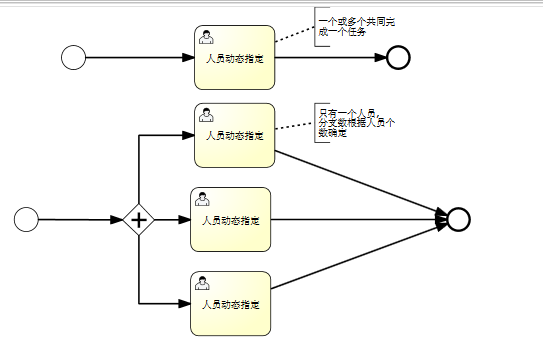

**简单指派任务**.我可以选择一批人,进行任务指派,类似于发邮件(或电话)通知某些人完成某件事情.  
  **操作序列**:点击发起指派任务...进入向导a.选择用户,选择参与人 b.设置属性,名称,描述,参与人都需要提交还是有一个提交即可,参与人提交后直接结束还是再把任务发给我. c.可添加附件,或者挂一个电子表格,或嵌套一个指定页面,或者选择几张报表.  
需要内置或者动态生成以下几种工作流
只有一个节点:  
1.  开始->任务->结束 (其中任务关联一个或多个用户,有一个提交则结束)  
2.  开始->分支->任务|任务|任务->结束 (其中分之后的任务同时进行,任务关联一个用户,任务个数与选择的用户个数有关)  
两个节点的:  
1. 开始->任务1->任务2 ->结束 (任务关联一个活多个用户,任务2用户可以驳回)
2. 开始->分支->任务1|任务1|任务1->任务2 ->结束 (任务1只关联一个用户,任务1有人提交就到任务2,任务2可驳回,任务1的个数与选择的用户相关)
3. 开始->分支->任务1|任务1|任务1->合并->任务2->结束(任务1所有用户都提交后,再到任务2)
  
              

 

不使用现有任务表(留给bfr任务)新增一个任务表.

 